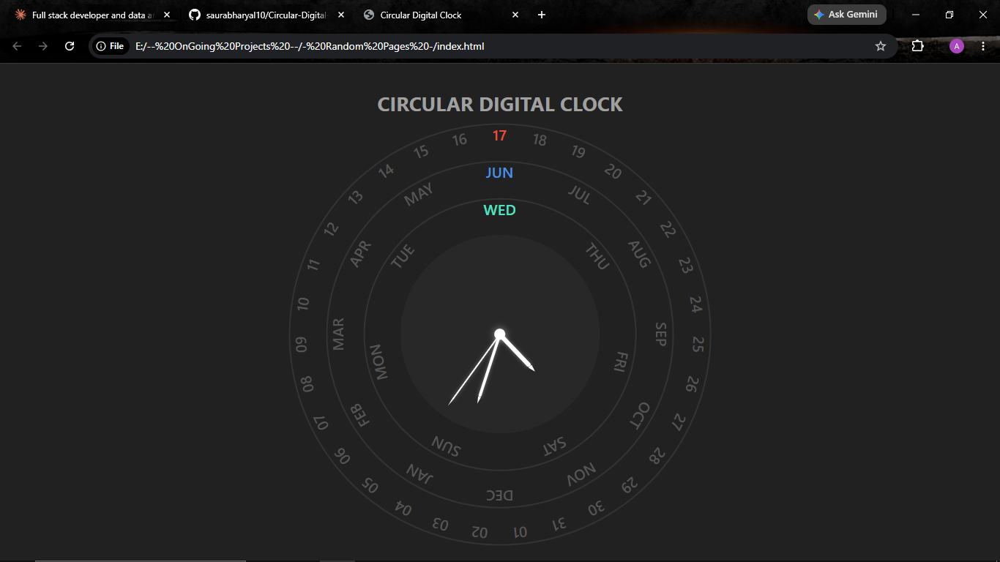

# Circular Digital Clock

A single-page web app that reimagines the classic digital clock as a circular, dial-based interface. Instead of a flat HH:MM:SS readout, the current date, month, and day of the week are laid out on three rotating concentric rings, with a live analog clock face at the center. Everything recalculates every second so the present moment always sits at the top of each ring, with color-coded highlighting for the active date, month, and day.

🔗 **Live Demo:** [saurabharyal10.github.io/Circular-Digital-Clock](https://saurabharyal10.github.io/Circular-Digital-Clock/)

## Overview

The clock is built entirely with vanilla HTML, CSS, and JavaScript in a single file, no frameworks, no build tools, no dependencies. On load, three rings are generated dynamically (date, month, day) and an analog clock face is rendered at the center. A timer running every second reads the system time, rotates the hour/minute/second hands accordingly, and rotates each ring so that today's date, this month, and the current day of the week land at the top-center position, highlighted in their own accent color.

## Features

- **Three concentric rotating rings** — an outer Date ring (01–31), a middle Month ring (Jan–Dec), and an inner Day ring (Sun–Sat)
- **Auto-aligning rings** — each ring rotates in real time so today's date, the current month, and the current day always sit at the top of their ring
- **Color-coded active states** — active date highlighted in red, active month in blue, active day in mint green, making the current moment easy to spot at a glance
- **Live analog clock face** — hour, minute, and second hands calculated from the system clock and rotated with CSS transforms, glowing white against a dark center dial
- **Real-time updates** — the entire display refreshes every second via `setInterval`, no page reload needed
- **Fully responsive layout** — sized with `vmin` units so the clock scales cleanly from desktop down to mobile, with a dedicated media query for smaller screens
- **Dark theme UI** — charcoal background with a clean, minimal aesthetic and a subtle glow on the clock hands
- **Zero dependencies** — no libraries, no package installs, just one HTML file that runs in any modern browser

## Tech Stack

- **HTML5** — semantic structure for the clock container, rings, and central dial
- **CSS3** — Flexbox for centering, CSS transforms (`rotate`, `translate`) for the clock hands and ring positioning, `vmin`-based responsive sizing, CSS transitions for smooth ring rotation, and media queries for mobile scaling
- **Vanilla JavaScript (ES6)** — DOM manipulation to generate ring labels dynamically, the native `Date` object to read real-time values, and `setInterval` to drive the per-second update loop

## Screenshots


*The clock displaying the current date, month, and day rings with the live analog hands at the center.*

## Project Structure

This is a single-file project, everything lives in one HTML document:

```
Circular-Digital-Clock/
└── index.html    # All markup, styles, and clock logic in one file
```

## Getting Started

### Option 1: View the Live Demo
Open [saurabharyal10.github.io/Circular-Digital-Clock](https://saurabharyal10.github.io/Circular-Digital-Clock/) directly in your browser.

### Option 2: Run Locally
1. Clone the repository
   ```bash
   git clone https://github.com/saurabharyal10/Circular-Digital-Clock.git
   ```
2. Navigate into the project folder
   ```bash
   cd Circular-Digital-Clock
   ```
3. Open `index.html` in any modern browser, either by double-clicking the file or using a tool like VS Code's Live Server extension

No installs, build steps, or server setup required.

## Author

**Saurabh Aryal**
Full Stack Developer & Data Analyst

- GitHub: [github.com/saurabharyal10](https://github.com/saurabharyal10)
- LinkedIn: [[LinkedIn](https://www.linkedin.com/in/saurabh-aryal-0b4b80209/)]
- Portfolio: [saurabh-aryal.com.np](https://saurabh-aryal.com.np)
